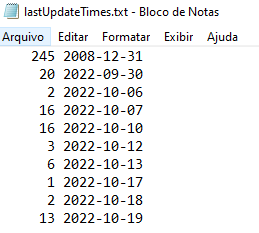

## Andro-Bash - Scripts for Android ADB

The following image shows the expected output which is basically information about the installed packages, packages that are third party and packages that are not from Google Play.
It also retreives information about installation/update dates.

## Package Details

You can get information about all installed packages

## Hidden Packages

You can get information about all installed packages, including hidden packages.

## Third Party packages

You can get the list of packages that were installed by the user and information about packages that didn't came from google play

## When packages were first installed

This can give any hint about when the phone was configured/initialized.

